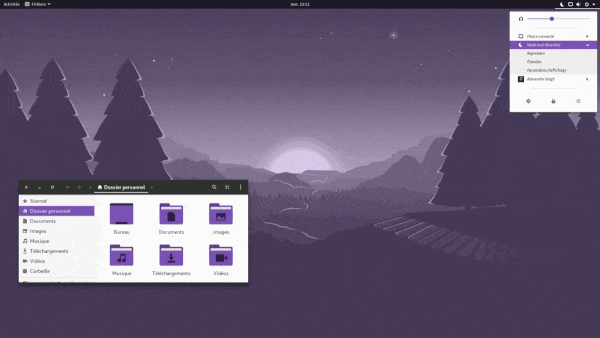

---

:information_source: **Need matching icons and wallpapers?
Check [papirus-kolorizer](https://github.com/DarthWound/papirus-kolorizer) and [wallpaper-kolorizer](https://github.com/DarthWound/wallpaper-kolorizer)!**

---

This bash script provides an easy way to change [Materia GTK theme](https://github.com/nana-4/materia-theme) primary and accent colors.

-> [fullsize screenshot](kolorizerSC.png?raw=true) <-

## Installation

You don't have to download Materia, this script does everything for you.

`cd $(xdg-user-dir DOWNLOAD)`

`wget https://raw.githubusercontent.com/DarthWound/materia-kolorizer/master/materia-kolorizer.sh`

If script isn't executable, change permissions:

`chmod +x materia-kolorizer.sh`

## Usage

Before anything, please install Materia build requirements:
- sassc
- inkscape
- optipng
- gtk2 murrine engine

Launch the script:

`cd $(xdg-user-dir DOWNLOAD) && ./materia-kolorizer.sh`

*It won't replace your existing Materia installation if any.*

Default color is "Bootstrap purple" #7952B3. To change colors, open the script in a text editor and modify the HEX color codes in variables *(lines beginning with "readonly" at the top of the script)*. Some color codes are commented in the script to help you quickly find something you may like. You can set a custom name for the theme too.

Please note that I changed GNOME Shell fonts too, since GNOME 3.28 Cantarell supports different weights. If you want to keep Materia defaults *(Roboto and M+1c)* then edit the script and remove the matching lines *(57-58)*.

*PS: I know that there is a script provided by Materia (and Oomox utility) to create custom themes, the difference here is that we only change primary/accent colors and keep Materia theme (+variants) totally intact.*
